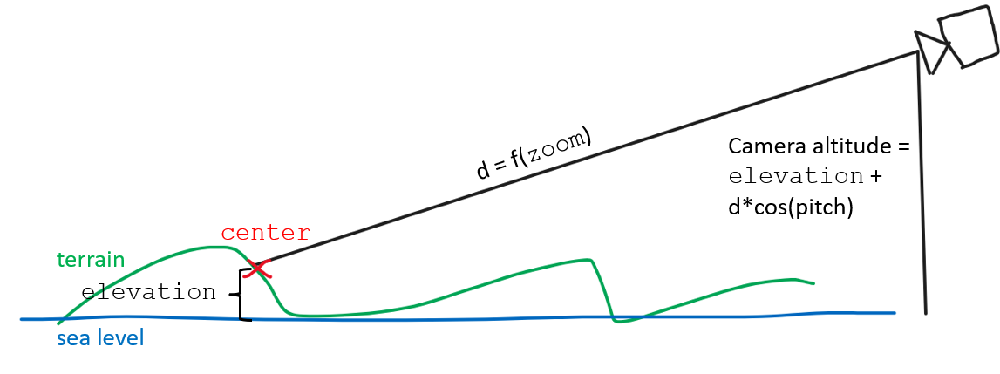
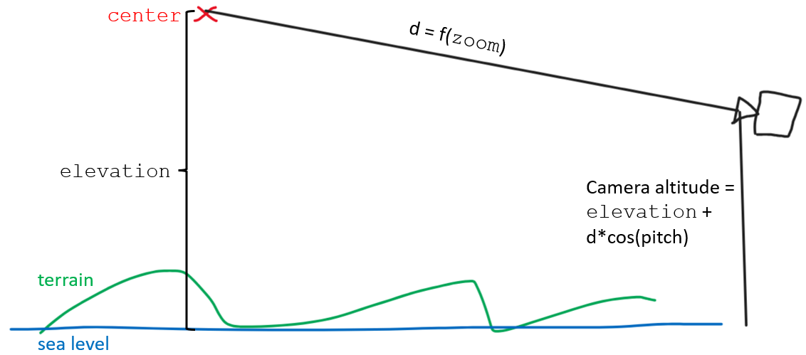
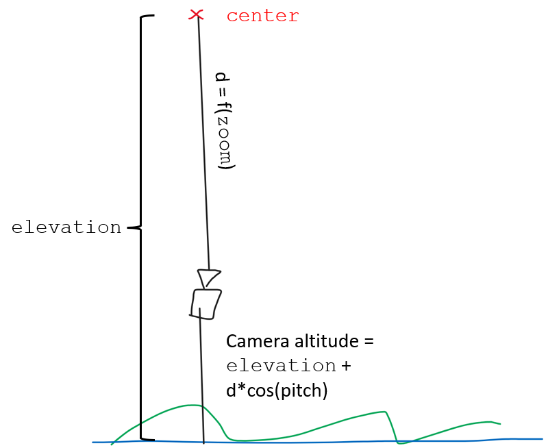
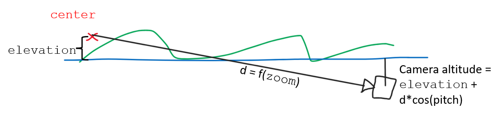

# Cách tính vị trí camera

Hướng dẫn này mô tả cách vị trí camera được tính toán dựa trên điểm trung tâm (center point), mức zoom, và góc xoay camera.
Các biến `center`, `elevation`, `zoom`, `pitch`, `bearing`, và `fov` của `Transform` điều khiển vị trí của camera một cách gián tiếp.

`elevation` thiết lập độ cao của "điểm trung tâm" so với mực nước biển. Trong trường hợp sử dụng thông thường (`centerClampedToGround = true`), thư viện sẽ chỉnh sửa `elevation` để cố gắng giữ điểm trung tâm luôn nằm trên địa hình (terrain) (hoặc ở 0 MSL nếu không bật terrain). Khi `centerClampedToGround = false`, người dùng tự cung cấp giá trị elevation của điểm trung tâm.

`zoom` thiết lập khoảng cách từ điểm trung tâm đến camera (kết hợp với `fovInRadians`, hiện đang được hardcode).

Kết hợp lại, `zoom`, `elevation`, và `pitch` xác định độ cao (altitude) của camera:

Xem `MercatorTransform::getCameraAltitude()`:
```typescript
    getCameraAltitude(): number {
        const altitude = Math.cos(this.pitchInRadians) * this._cameraToCenterDistance / this._helper._pixelPerMeter;
        return altitude + this.elevation;
    }
```



Để cho phép pitch > 90, "điểm trung tâm" phải được đặt lệch khỏi mặt đất. Điều này cho phép camera vẫn ở phía trên mặt đất khi nó nghiêng (pitch) vượt quá 90. Việc này yêu cầu thiết lập `centerClampedToGround = false`.



Cùng một công thức toán học được áp dụng cho dù điểm trung tâm nằm trên terrain hay không, và dù camera nằm phía trên hay phía dưới mặt đất:





Để giúp người dùng định vị camera, `Camera` export hàm `calculateCameraOptionsFromCameraLngLatAltRotation()`.
