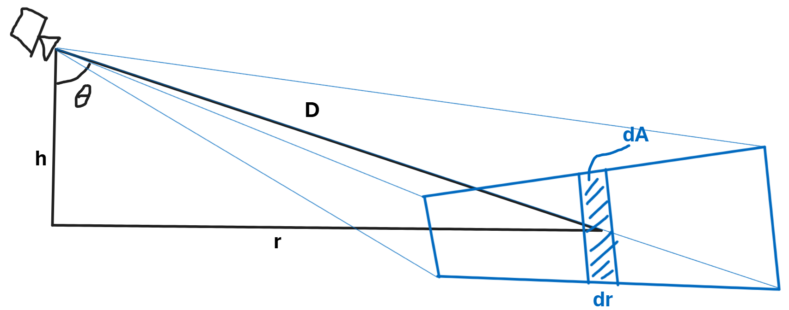

# Tính toán Covering Tiles
## Ký hiệu:

$r$, `distanceToTile2D`, khoảng cách mặt đất (ground range) từ camera đến tile

$D$, `distanceToTile3D`, khoảng cách nghiêng (slant range) từ camera đến tile

$h$, `distanceToTileZ`, độ cao camera phía trên tile

$\theta$, `thisTilePitch`, góc pitch từ camera đến tile

$A$, diện tích (đơn vị bản đồ)

$Z$, mức zoom của tile

$S$, hệ số tỉ lệ của tile (pixel trên mỗi đơn vị bản đồ): $S = 2^Z$

$S_r$, hệ số tỉ lệ tâm được yêu cầu (pixel trên mỗi đơn vị bản đồ)

$S_c$, hệ số tỉ lệ tâm (pixel trên mỗi đơn vị bản đồ)

chỉ số dưới $c$, tâm theo chiều dọc của màn hình

$b$, `pitchTileLoadingBehavior`, tham số tinh chỉnh việc tải tile

## Hình học

Các khoảng cách liên hệ với nhau qua các phương trình

$$ r(\theta) = h\tan\theta $$
$$ D(\theta) = h\sec\theta $$

Giả sử trường nhìn theo chiều ngang (horizontal field of view) là một góc nhỏ $\alpha$.

Khi đó diện tích của một dải vô cùng nhỏ (infinitesimal strip) trên mặt đất là

$$ dA = \alpha D dr$$

Theo đơn vị tile, diện tích vi phân là

$$ dT = S^2dA =  S^2\alpha D dr = S^2\alpha D \frac{dr}{d\theta}d\theta = S^2\alpha Dh \sec ^2\theta d\theta = S^2\alpha h^2 \sec ^3\theta d\theta = S^2\alpha D_c^2 \cos^2 \theta_c \sec ^3\theta d\theta$$

## Tính toán tỉ lệ tile

Hệ số tỉ lệ của tile được cho bởi công thức

$$ S = S_c\frac{D_c}{D}\cos^{b/2}\theta = S_c D_c \frac{\cos^{b/2+1}\theta}{h} = S_c \frac{\cos^{b/2+1}\theta}{\cos\theta_c} $$

Công thức này mang tính tùy chọn (arbitrary) nhưng có một số đặc điểm hay:

Nếu $S_c = S_r$ và $b = 0$, thì $S = S_c\frac{D_c}{D}$, khớp với hành vi tại `pitch == 0` và khiến các tile được tải với chiều rộng màn hình xấp xỉ bằng nhau.

Nếu $b = 1$, thì các tile được tải với diện tích màn hình xấp xỉ bằng nhau. (Đây là giá trị mặc định.)

Nếu $b = 2$, thì các tile được tải với chiều cao màn hình xấp xỉ bằng nhau.

Nếu $b = -1$, thì $S = S_c\frac{Dc}{cos\theta_c}$ và tất cả các tile được tải ở cùng một mức zoom. Mọi tile thay đổi mức zoom cùng một lúc.

# `maxZoomLevelsOnScreen`

Số mức zoom hiển thị trên màn hình là
$$N=Z_{max} - Z_{min} + 1 = Z(\theta_{min}) - Z(\theta_{max}) + 1 = \log_2(\frac{S(\theta_{min})}{S(\theta_{max})}) + 1$$

Với công thức trên cho $S$,

$$ N = \log_2(\frac{\cos^{b/2+1}\theta_{min}}{\cos^{b/2+1}\theta_{max}}) + 1 = \log_2(\frac{\cos\theta_{min}}{\cos\theta_{max}})(b/2+1) + 1$$

$N$ đạt cực đại khi $\theta_max$ nằm ở đường chân trời (horizon):

$$ N_{max} = \log_2(\frac{\cos(\theta_{horizon} - vFOV)}{\cos\theta_{horizon}})(b/2+1) + 1$$

Sắp xếp lại, $b$ có thể được viết dưới dạng hàm của $N_{max}$:

$$ b = 2(\frac{N_{max} - 1}{\log_2(\frac{\cos(\theta_{horizon} - vFOV)}{\cos\theta_{horizon}})}-1) $$

# `tileCountMaxMinRatio`

Do đó tổng diện tích tile là
$$T = \int_{\theta_1}^{\theta2} S_c^2 \frac{\cos^{b+2}\theta}{\cos^2\theta_c}\alpha D_c^2 \cos^2\theta_c \sec ^3\theta d\theta = S_c^2 D_c^2\alpha \int_{\theta_1}^{\theta2} \cos^{b-1}\theta d\theta $$

Và tỉ lệ giữa diện tích tile so với diện tích tile tại `pitch == 0` là

$$ \frac{T}{T_0} = \frac{S_c^2 D_c^2\alpha \int_{\theta_1}^{\theta2} \cos^{b-1}\theta d\theta}{S_r^2 D_c^2\alpha \int_{-vFOV/2}^{vFOV/2} \cos^{b-1}\theta d\theta} = \frac{S_c^2}{S_r^2}  \frac{\int_{\theta_1}^{\theta2} \cos^{b-1}\theta d\theta}{\int_{-vFOV/2}^{vFOV/2} \cos^{b-1}\theta d\theta}$$

Để đặt $\frac{T}{T_0}$ bằng `tileCountMaxMinRatio`,

$$\frac{S_c^2}{S_r^2}  \frac{\int_{\theta_1}^{\theta2} \cos^{b-1}\theta d\theta}{\int_{-vFOV/2}^{vFOV/2} \cos^{b-1}\theta d\theta} = \text{tileCountMaxMinRatio} $$

Do đó

$$S_c = S_r(\text{tileCountMaxMinRatio} \frac{\int_{-vFOV/2}^{vFOV/2} \cos^{b-1}\theta d\theta}{\int_{\theta_1}^{\theta2} \cos^{b-1}\theta d\theta})^{1/2} $$

và

$$Z_c = Z_r+\log_2{(\text{tileCountMaxMinRatio} \frac{\int_{-vFOV/2}^{vFOV/2} \cos^{b-1}\theta d\theta}{\int_{\theta_1}^{\theta2} \cos^{b-1}\theta d\theta})}/2 $$

## Tích phân

Biểu thức $\int_{\theta_1}^{\theta2} \cos^{p}\theta d\theta$ xuất hiện hai lần trong phương trình của $Z_c$. Lời giải là

$$\int_{\theta_1}^{\theta2} \cos^{p}\theta d\theta = - \frac{\sin\theta_2}{|\sin\theta_2|}\frac{\cos^{p+1}\theta_2}{p+1} {}_2F_1(\frac{1}{2}, \frac{p+1}{2},\frac{p+3}{2}, \cos^2\theta_2) + \frac{\sin\theta_1}{|\sin\theta_1|}\frac{\cos^{p+1}\theta_1}{p+1} {}_2F_1(\frac{1}{2}, \frac{p+1}{2},\frac{p+3}{2}, \cos^2\theta_1)$$

trong đó ${}_2F_1()$ là hàm siêu hình học (hypergeometric function).
