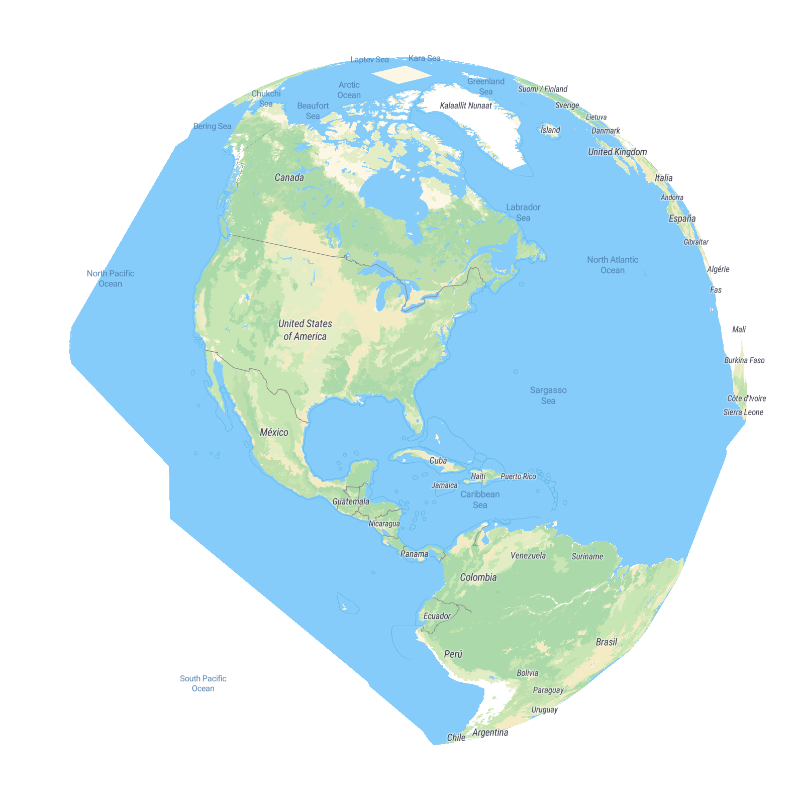
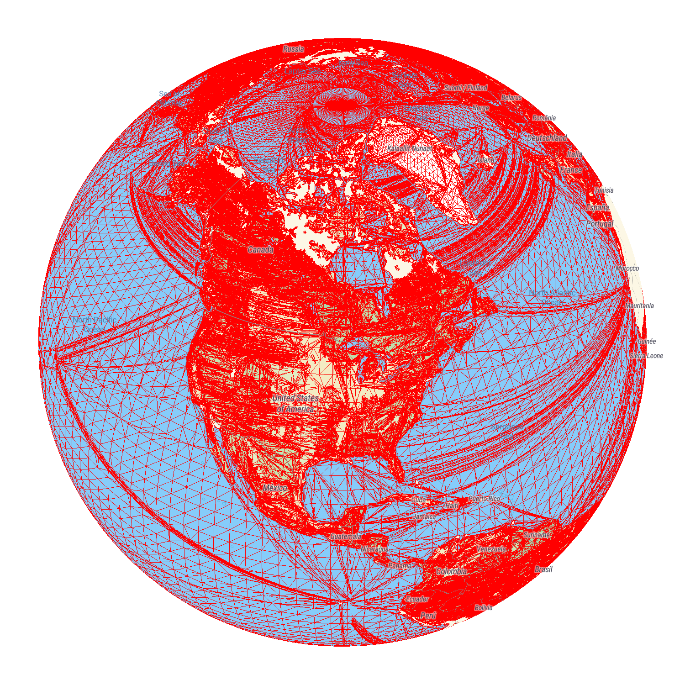
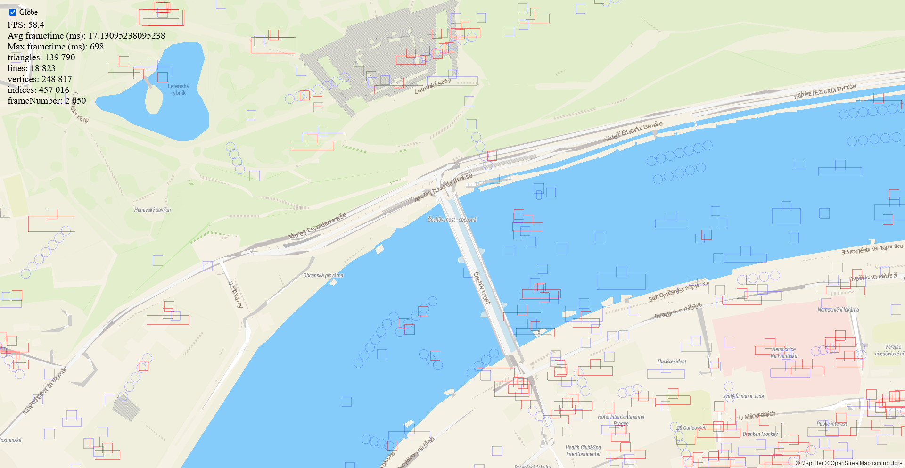

# Phép chiếu Globe (Globe projection)

Hướng dẫn này mô tả cơ chế hoạt động bên trong của phép chiếu globe.
Globe vẽ cùng các polygon và line vector như phép chiếu mercator,
đảm bảo hình ảnh rõ ràng, không bị méo (non-stretched) ở mọi góc nhìn và hỗ trợ các layer cùng geometry động.

Phép chiếu thực tế được thực hiện qua ba bước:

- tính toạ độ cầu góc (angular spherical coordinates) từ dữ liệu tile web mercator nguồn
- chuyển đổi toạ độ cầu thành một vector 3D - một điểm trên bề mặt của một hình cầu đơn vị (unit sphere)
- chiếu vector 3D đó bằng một ma trận chiếu phối cảnh (perspective projection matrix) thông thường

Vì vậy, dưới góc nhìn của phép chiếu, globe chính là một hình cầu đơn vị.
Điều này cũng đơn giản hóa rất nhiều phép toán, và được sử dụng rộng rãi trong class globe transform.

Geometry được chiếu lên hình cầu trong vertex shader.

## Hành vi khi zoom

Để giữ tính nhất quán với bản đồ web mercator, globe được tự động phóng to khi tâm bản đồ tiến gần các cực.
Điều này giữ cho tâm bản đồ trông tương tự về mặt hình ảnh với một bản đồ mercator có cùng x, y và zoom.
Tuy nhiên, khi pan globe hoặc thực hiện các animation camera,
chúng ta không muốn hành tinh trở nên lớn hơn hoặc nhỏ hơn khi thay đổi vĩ độ.
Do đó, chuyển động bản đồ sẽ bù trừ cho sự thay đổi kích thước hành tinh bằng cách
thay đổi mức zoom song song với sự thay đổi vĩ độ.

Hành vi này hoàn toàn tự động và trong suốt đối với người dùng.
Trường hợp duy nhất người dùng cần lưu ý điều này là khi
kích hoạt animation bằng lập trình như `flyTo` và `easeTo`
và sử dụng chúng để vừa thay đổi vĩ độ tâm bản đồ *đồng thời*
thay đổi zoom của bản đồ đến một giá trị dựa trên zoom ban đầu của bản đồ.
Ví dụ [globe-zoom-planet-size-function](https://maplibre.org/maplibre-gl-js/docs/examples/globe-zoom-planet-size-function/) minh họa cách
bù trừ cho sự thay đổi kích thước hành tinh trong trường hợp này.
Mọi animation camera khác (những animation chỉ định zoom mục tiêu
không dựa trên zoom hiện tại, hoặc không chỉ định zoom nào cả) sẽ hoạt động như mong đợi.

## Shaders

Hầu hết các vertex shader sử dụng hàm `projectTile`, hàm này
nhận vào một vector 2D toạ độ bên trong tile đang được vẽ,
trong khoảng 0..EXTENT (8192), và trả về phép chiếu cuối cùng có thể
được truyền trực tiếp vào `gl_Position`.
Khi vẽ một tile, các uniform phù hợp phải được thiết lập để chuyển đổi từ
các toạ độ cục bộ trong tile (tile-local coordinates) này sang web mercator.

Phần triển khai của `projectTile` được tự động chèn (inject) vào mã nguồn shader.
Các phần triển khai khác nhau có thể được chèn vào, tùy thuộc vào phép chiếu đang hoạt động.
Nhờ đó nhiều shader dùng chung chính xác cùng một đoạn code cho cả mercator và globe,
mặc dù cũng có những shader dùng `#ifdef GLOBE` cho phần code chỉ dành riêng cho globe.

## Phân chia nhỏ (Subdivision)

Nếu chúng ta vẽ các tile mercator trực tiếp bằng shader của globe, chúng ta sẽ có được một hình cầu bị biến dạng.
Điều này là do cách các polygon và line được tam giác hóa (triangulated) trong MapLibre - thuật toán earcut
tạo ra càng ít tam giác càng tốt, điều này đôi khi có thể tạo ra các tam giác rất lớn, ví dụ như ở các vùng đại dương.
Hành vi này là mong muốn trên bản đồ mercator, nhưng nếu chúng ta chiếu trực tiếp các đỉnh của những tam giác lớn như vậy lên globe,
chúng ta sẽ không có được đường chân trời, đường kẻ, v.v. bị cong đúng cách.
Vì lý do này, trước khi một tile hoàn tất việc tải, geometry của nó (cả polygon lẫn line) sẽ được phân chia nhỏ thêm.

Hình bên dưới minh họa globe sẽ trông như thế nào nếu không có phân chia nhỏ.
Chú ý các vùng đại dương bị biến dạng, và đường biên giới Mỹ-Canada không được uốn cong đúng cách.



Việc phân chia nhỏ cần được thực hiện nhanh nhất có thể, nếu không nó sẽ làm chậm đáng kể quá trình tải tile.
Hiện tại cách tiếp cận nhanh nhất dường như là lấy geometry đầu ra từ `earcut` rồi phân chia nhỏ thêm phần đó.

Khi chỉnh sửa phần phân chia nhỏ, hãy cẩn thận vì nó rất dễ gặp các lỗi tinh vi (subtle errors), dẫn đến các đường nối (seam) chỉ dày một pixel.
Việc phân chia nhỏ cũng cần chia geometry tại các vị trí nhất quán,
để các polygon và line khớp nhau đúng cách khi được chiếu.

Chúng ta sử dụng cách phân chia nhỏ tạo ra một lưới vuông (square grid), có thể thấy trong hình bên dưới.



Việc phân chia nhỏ được cấu hình trong đối tượng Projection.
Độ mịn của phân chia nhỏ (subdivision granularity) được xác định bởi độ mịn cơ sở của tile (base tile granularity) và độ mịn tối thiểu cho phép.
Tile ở mức zoom 0 sẽ có độ mịn cơ sở, tile ở zoom 1 sẽ có một nửa độ mịn đó, v.v.,
nhưng không bao giờ nhỏ hơn độ mịn tối thiểu.

Độ mịn phân chia nhỏ tối đa là 128 cho các fill layer là đủ để có được đường chân trời cong mượt mà,
đồng thời không tạo ra quá nhiều geometry mới và không tràn (overflow) chỉ số đỉnh 16-bit được dùng xuyên suốt MapLibre.

Các raster tile nói riêng cần một độ mịn cơ sở tương đối cao, vì nếu không chúng sẽ có
hiện tượng cong vênh và biến dạng có thể nhìn thấy khi thay đổi mức zoom.

## Độ chính xác số thực dấu phẩy động & chuyển tiếp sang mercator

Shader làm việc với số thực dấu phẩy động (floating point) 32-bit (64-bit cũng khả thi trên một số nền tảng, nhưng rất chậm).
23 bit mantissa và 1 bit dấu có thể biểu diễn tối đa khoảng 16 triệu giá trị,
nhưng chu vi trái đất là khoảng 40.000 km, tức là tương đương
khoảng một giá trị float32 cho mỗi 2,5 mét, không đủ chính xác cho một bản đồ.
Do đó nếu chúng ta sử dụng phép chiếu globe ở mọi mức zoom, chúng ta chắc chắn sẽ gặp vấn đề về độ chính xác.



Để khắc phục điều này, phép chiếu globe tự động chuyển sang phép chiếu mercator ở khoảng mức zoom 12.
Sự chuyển tiếp này diễn ra mượt mà, có animation và chỉ có thể nhận ra nếu nhìn rất kỹ,
bởi vì phép chiếu globe và mercator hội tụ ở các mức zoom cao, và quanh mức 12
chúng đã rất gần nhau.

Animation chuyển tiếp được triển khai trong hàm chiếu (projection function) của shader,
và được điều khiển bởi một tham số "globeness" được truyền từ transform.

## Độ chính xác vĩ độ trên GPU

Khi triển khai globe, chúng tôi nhận thấy phép chiếu globe không khớp với phép chiếu mercator
sau khi chuyển tiếp tự động được mô tả trong phần trước.
Sự không khớp này rất rõ ràng ở một số vĩ độ nhất định, bản đồ globe bị lệch bắc/nam hàng trăm mét,
nhưng ở các vĩ độ khác độ lệch nhỏ hơn nhiều. Hành vi này cũng không nhất quán - người ta có thể
kỳ vọng độ lệch tăng hoặc giảm dần theo khoảng cách từ xích đạo, nhưng thực tế không phải vậy.

Cuối cùng, chúng tôi đã truy ra đây là vấn đề trong shader chiếu, cụ thể là hàm `atan`
dùng để chuyển đổi Y mercator thành góc vĩ độ (`2*atan(exp(...)) - PI/2`).
Trên một số nhà sản xuất GPU, hàm này thiếu chính xác theo cách khớp với các độ lệch chiếu
đã quan sát được; việc trừ `PI/2` cho một giá trị gần `PI/2` cũng phá hủy hầu hết mantissa của float32
gần xích đạo bất kể GPU nào.

Bản sửa lỗi ban đầu đo lường sai số của `atan` này tại thời điểm chạy (render một framebuffer
1x1 pixel mỗi giây, so sánh với một giá trị tham chiếu tính trên CPU) và dịch chuyển ma trận chiếu
của globe để bù trừ. Cách này hiệu quả, nhưng chỉ sửa được sai số của riêng `atan`, và chỉ dưới dạng
một giá trị duy nhất được giả định là không đổi trên toàn bộ vùng bản đồ hiển thị.

Việc điều tra một báo cáo liên quan trên GPU Mali ([#7419](https://github.com/maplibre/maplibre-gl-js/issues/7419))
cho thấy `sin`/`cos` cũng có thể thiếu chính xác tương tự (thậm chí không đơn điệu - non-monotonic) trên một số phần cứng,
điều mà cách sửa chỉ nhắm vào `atan` chưa từng tính đến. Vì các đại lượng mà shader
thực sự cần là `sin(spherical_y)` và `cos(spherical_y)`, chứ không phải bản thân góc, các đồng nhất thức
nửa góc tang (tangent half-angle, hay đồng nhất thức Weierstrass) cho phép shader tính trực tiếp chúng từ
`t = exp(PI - mercator_y*2*PI)`:

```glsl
sin_sy = (t*t - 1.0) / (t*t + 1.0);
cos_sy = (2.0 * t)    / (t*t + 1.0);
```

Cách này chỉ dùng `exp()` và các phép toán hữu tỉ (rational arithmetic) - hoàn toàn không gọi `atan`, `sin` hay `cos` nào cho vĩ độ -
vừa chính xác hơn vừa loại bỏ luôn nhóm lỗi mà cơ chế sửa lỗi runtime cũ nhắm tới, vì vậy
cơ chế đó đã bị loại bỏ thay vì được điều chỉnh lại.

## Clipping (cắt xén)

Khi vẽ một hành tinh, chúng ta cần bằng cách nào đó cắt xén phần geometry nằm ở mặt sau (backfacing).
Vì MapLibre sử dụng Z-buffer để tối ưu hóa việc vẽ độ trong suốt, điền vào đó các giá trị tùy chỉnh,
chúng ta không thể dùng nó cho mục đích này.

Thay vào đó, chúng ta tính một mặt phẳng cắt qua đường chân trời, và với mỗi đỉnh
chúng ta tính khoảng cách từ mặt phẳng này và lưu vào `gl_Position.z`.
Điều này buộc phần cứng clipping của GPU phải cắt bỏ geometry vượt quá đường chân trời của hành tinh.
Điều này không ảnh hưởng đến các giá trị Z tùy chỉnh của MapLibre, vì chúng được thiết lập sau đó bằng
`glDepthRange`.

Tuy nhiên cách tiếp cận này không hoạt động trên một số điện thoại do khả năng là lỗi driver,
áp dụng `glDepthRange` và clipping sai thứ tự.
Vì vậy, thêm vào đó, face culling được sử dụng cho các fill và raster layer
(earcut không tạo ra thứ tự winding nhất quán, điều này được đảm bảo trong quá trình phân chia nhỏ)
và các line layer (vốn có thứ tự winding không nhất quán) loại bỏ các pixel vượt quá
đường chân trời trong fragment shader.

## Raster tile

Việc vẽ raster tile dưới globe phức tạp hơn phần nào so với dưới mercator,
vì dưới globe chúng dễ xuất hiện các đường nối (seam) nhỏ giữa các tile hơn.
Tile được vẽ dưới dạng lưới (mesh) đã phân chia nhỏ thay vì các hình tứ giác (quad) đơn giản, và độ cong
gần các cạnh có thể gây ra các đường nối, đặc biệt trong trường hợp hai tile ở
mức zoom khác nhau nằm cạnh nhau.

Để đảm bảo không có đường nối và mọi pixel đều được phủ bởi
texture tile hợp lệ (thay vì một viền bị kéo dãn từ tile lân cận),
trước tiên chúng ta vẽ tất cả các tile *không có* viền, đánh dấu tất cả các pixel đã vẽ vào stencil.
Sau đó, chúng ta vẽ tất cả các tile *có* viền, nhưng thiết lập stencil để loại bỏ tất cả các pixel
đã được vẽ trong lần đầu.

Điều này đảm bảo không có pixel nào bị vẽ hai lần, và các viền bị kéo dãn
chỉ được vẽ ở các vùng giữa các tile.

## Dữ liệu gần các cực

Các nguồn web mercator không mang dữ liệu vượt quá khoảng 85,05 độ vĩ tuyến, vì vậy một globe không có gì để vẽ giữa mép đó và cực. MapLibre lấp đầy khoảng trống này bằng cách kéo dài cạnh của mỗi tile giáp cực đến tận cực: quá trình phân chia nhỏ thêm một quạt (fan) các tam giác cực vào mỗi tile ở hàng mercator đầu tiên hoặc cuối cùng, và bất cứ thứ gì cắt qua mép mercator trong tile đó - một polygon fill, hoặc hàng cuối cùng của một texture raster - sẽ được kéo dãn ra tận cực. Cả nguồn vector lẫn raster đều thể hiện điều này, dễ thấy nhất là ở khu vực quanh Nam Cực, nơi một polygon đại dương cắt qua mép sẽ trở thành một mũi nhọn vươn đến cực. Không có dữ liệu nguồn để vẽ ở đó, vì vậy đây là kết quả mong đợi chứ không phải lỗi render ([#5433](https://github.com/maplibre/maplibre-gl-js/issues/5433)).

## Symbol (biểu tượng)

Việc render symbol cũng phải được điều chỉnh cho globe, cũng như việc phát hiện va chạm (collision detection) và đặt vị trí (placement).
MapLibre tính toán các bounding box vừa khít ngay cả cho các symbol bị cong dưới phép chiếu globe
bằng cách tính AABB từ phép chiếu của các góc hộp (box corners) và điểm giữa cạnh hộp (box edge midpoints) của symbol.
Đây là một phép xấp xỉ, nhưng hoạt động tốt trong thực tế.

## Các phép biến đổi và unproject

Hầu hết các hàm projection và unproject từ transform interface đều được điều chỉnh cho globe,
với một vài lưu ý.
Hàm `setLocationAtPoint` đôi khi có thể không tìm được một giải pháp hợp lệ
cho các tham số đã cho.
Globe transform hiện tại chưa hỗ trợ việc ràng buộc (constrain) tâm bản đồ.

## Controls (điều khiển)

Globe sử dụng các control hơi khác so với bản đồ mercator.
Pan, zoom, v.v. nhận biết được hình cầu và sẽ hoạt động một cách trực quan,
cũng như các animation camera như `flyTo` và `easeTo`.

Cụ thể, khi zoom, vị trí bên dưới con trỏ vẫn giữ nguyên bên dưới con trỏ,
giống như trên bản đồ mercator.
Tuy nhiên hành vi này có một số hạn chế trên globe.
Trong một số tình huống, chẳng hạn như zoom vào mép của hành tinh,
cách zoom này sẽ dẫn đến việc pan bản đồ nhanh và khó chịu.
Do đó hành vi này được giảm dần ở các mức zoom thấp và thay thế bằng một phép xấp xỉ.

Cũng có các trường hợp biên khác, chẳng hạn như khi nhìn vào các cực của hành tinh
và cố gắng zoom vào một vị trí ở bán cầu bên kia ("phía sau cực").
MapLibre không hỗ trợ di chuyển camera băng qua các cực, vì vậy thay vào đó chúng ta cần xoay vòng quanh.
Trong trường hợp này, một phép xấp xỉ cũng được sử dụng thay vì zoom chính xác.

Các control của globe cũng sử dụng quán tính pan (panning inertia), giống như mercator.
Chúng tôi đã đặc biệt chú ý để giữ tốc độ chuyển động của quán tính nhất quán.
