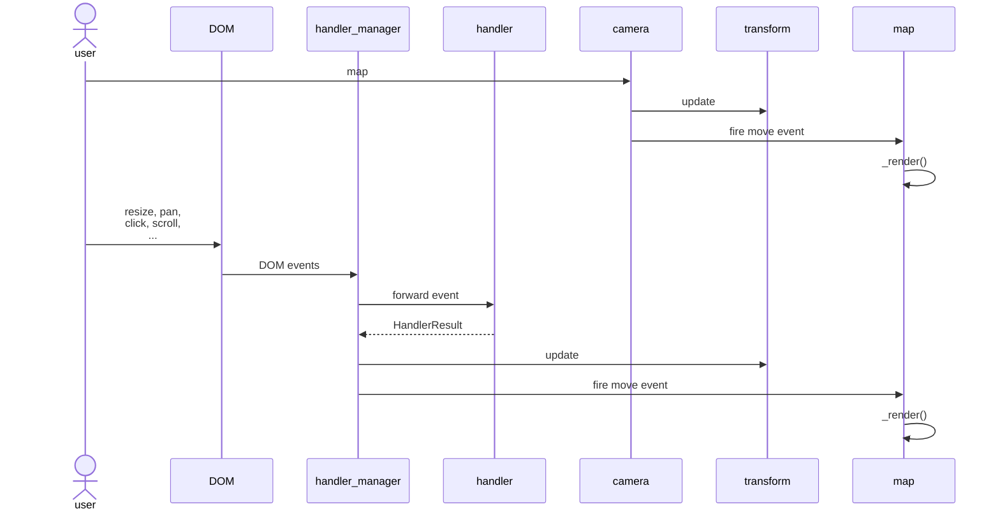
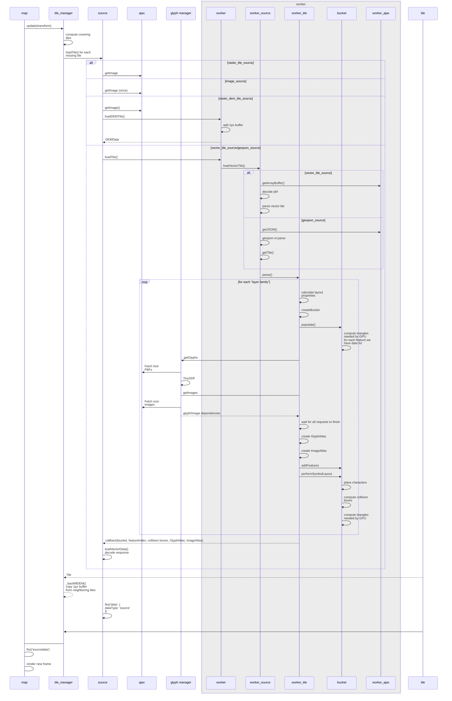
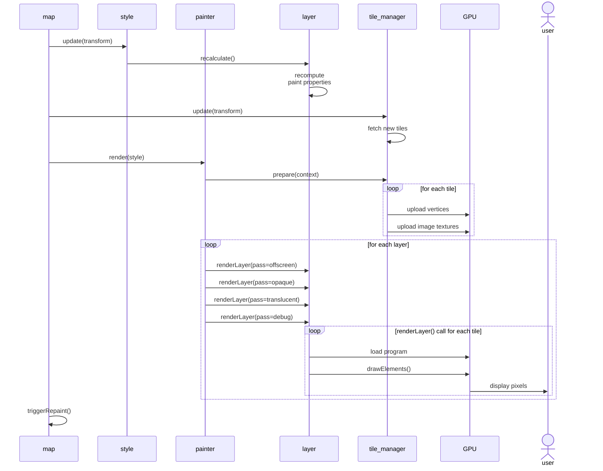

# Vòng đời của một Tile (Life of a Tile)

Hướng dẫn này đi theo từng bước để giải thích điều gì xảy ra khi bạn tải một tile mới. Ở mức cao, quá trình xử lý gồm 3 phần:

- [Event loop](#event-loop) phản hồi tương tác của người dùng và cập nhật trạng thái nội bộ của bản đồ (viewport hiện tại, góc camera, v.v.)
- [Tile loading](#tile-loading) fetch bất đồng bộ các tile, hình ảnh, font, v.v. mà trạng thái hiện tại của bản đồ cần
- [Render loop](#render-loop) render trạng thái hiện tại của bản đồ lên màn hình

Lý tưởng nhất, event loop và khung hình render chạy ở 60 khung hình/giây, và toàn bộ công việc nặng của việc tải tile diễn ra bất đồng bộ bên trong một web worker.

## Event Loop

- [Transform](../src/geo/transform.ts) giữ các chi tiết viewport hiện tại (pitch, zoom, bearing, bounds, v.v.). Có hai nơi trong code cập nhật trực tiếp transform:
  - [Camera](../src/ui/camera.ts) (parent class của [Map](../src/ui/map)) để phản hồi các lời gọi tường minh đến [Camera#panTo](../src/ui/camera.ts#L207), [Camera#setCenter](../src/ui/camera.ts#L169)
  - [HandlerManager](../src/ui/handler_manager.ts) để phản hồi các sự kiện DOM. Nó chuyển tiếp các sự kiện đó đến các bộ xử lý tương tác (interaction processors) sống trong [src/ui/handler](../src/ui/handler), các bộ xử lý này tích lũy thành một [HandlerResult](../src/ui/handler_manager.ts#L64) đã được gộp lại, kích hoạt một vòng lặp render frame, giảm dần quán tính (inertia) và điều chỉnh (nudge) map.transform theo lượng đó ở mỗi khung hình từ [HandlerManager#\_updateMapTransform()](../src/ui/handler_manager.ts#L413). Vòng lặp đó tiếp tục cho đến khi quán tính giảm về 0.
- Cả camera và handler_manager đều có trách nhiệm phát (fire) các sự kiện `move`, `zoom`, `movestart`, `moveend`, ... trên bản đồ sau khi chúng cập nhật transform. Mỗi sự kiện này (cùng với các thay đổi style và sự kiện tải dữ liệu) sẽ kích hoạt một lời gọi đến [Map#\_render()](../src/ui/map.ts#L2480), hàm này render một khung hình duy nhất của bản đồ.

## Tải Tile (Tile loading)

[Map#\_render()](../src/ui/map.ts#L2480) hoạt động theo 2 chế độ khác nhau dựa trên giá trị của `Map._sourcesDirty`. Khi `Map._sourcesDirty === true`, nó bắt đầu bằng việc hỏi từng source xem có cần tải dữ liệu mới nào không:

- Gọi [TileManager#update(transform)](../src/tile/tile_manager.ts#L479) trên mỗi source dữ liệu bản đồ. Hàm này tính toán các tile lý tưởng phủ (cover) viewport hiện tại và yêu cầu những tile còn thiếu. Khi một tile bị thiếu, nó sẽ tìm kiếm các tile con/cha để tìm phương án thay thế tốt nhất hiển thị trong lúc tile lý tưởng đang được tải.
- Gọi `Source#loadTile(tile, callback)` trên mỗi source để tải tile còn thiếu. Mỗi source triển khai việc này theo cách khác nhau:
  - [RasterTileSource#loadTile](../src/source/raster_tile_source.ts#L110) chỉ đơn giản là khởi động một request getImage sử dụng [src/util/image_request](../src/util/image_request.ts), thứ giữ một hàng đợi các request đang chờ và giới hạn số lượng request đang tiến hành.
  - [RasterDEMTileSource#loadTile](../src/source/raster_dem_tile_source.ts#L39) bắt đầu tương tự để fetch hình ảnh, nhưng sau đó gửi các byte trong một message `loadDEMTile` đến một worker để xử lý trước khi trả kết quả về. Việc lấy pixel từ response hình ảnh đòi hỏi phải vẽ nó lên một canvas rồi đọc lại pixel. Việc này có thể tốn kém, vì vậy khi trình duyệt hỗ trợ `OffscreenCanvas`, hãy làm việc đó trong một worker, nếu không thì làm ở đây trước khi gửi đi.
    - `[trong web worker]` [RasterDEMTileWorkerSource#loadTile](../src/source/raster_dem_tile_worker_source.ts#L21) nạp dữ liệu rgb thô vào một instance [DEMData](../src/data/dem_data.ts). Việc này sao chép các pixel biên ra một viền 1px để tránh các hiện tượng răng cưa (artifact) ở cạnh và truyền lại cho main thread.
  - [VectorTileSource#loadTile](../src/source/vector_tile_source.ts#L184) gửi một message `loadTile` hoặc `reloadTile` đến một worker:
    - `[trong web worker]` [Worker#loadTile](../src/source/worker.ts#L96) xử lý message và chuyển nó đến [VectorTileWorkerSource#loadTile](../src/source/vector_tile_worker_source.ts#L100)
      - Gọi [VectorTileWorkerSource#loadVectorTile](../src/source/vector_tile_worker_source.ts#L42), hàm này sử dụng
        - [ajax#getArrayBuffer()](../src/util/ajax.ts#L284) để fetch các byte thô
        - [pbf](https://github.com/mapbox/pbf) để decode protobuf, sau đó
        - [@mapbox/vector-tile#VectorTile](https://github.com/mapbox/vector-tile) để parse vector tile.
        - Kết quả được đưa vào một instance [WorkerTile](../src/source/worker_tile.ts) mới.
      - Gọi [WorkerTile#parse()](../src/source/worker_tile.ts#L64) và cache kết quả trong worker theo tile ID:
        - Đối với mỗi source layer của vector tile, đối với mỗi style layer phụ thuộc vào source layer đó và đang hiển thị ("layer family"):
          - Tính toán các thuộc tính layout (recalculateLayers)
          - Gọi style.createBucket, hàm này ủy quyền cho một loại bucket trong [src/data/bucket/\*](../src/data/bucket), là các subclass của [src/data/bucket](../src/data/bucket.ts)
          - Gọi [Bucket#populate()](../src/data/bucket.ts) với các feature từ source layer này trong vector tile. Việc này tính trước toàn bộ dữ liệu mà main thread cần nạp vào GPU để render mỗi khung hình (tức là các buffer chứa vertex của tất cả các tam giác cấu thành hình dạng)
        - Hầu hết các loại layer chỉ lưu trữ các feature đã được tam giác hóa trong lần đầu này, nhưng một số layer có các phụ thuộc dữ liệu (data dependencies), vì vậy sẽ hỏi main thread để lấy:
          - Font PBF (getGlyphs)
            - Được xử lý bởi [GlyphManager](../src/render/glyph_manager.ts) trên main thread, đóng vai trò như một cache toàn cục cho các glyph mà chúng ta đã lấy về. Khi thiếu một glyph, nó sẽ dùng [tinysdf](https://github.com/mapbox/tiny-sdf) để render ký tự lên một canvas, hoặc thực hiện một network request để tải file font PBF cho phạm vi chứa glyph còn thiếu.
          - Icon và pattern (getImages({type: 'icon' | 'pattern' }))
            - Được xử lý bởi [ImageManager](../src/render/image_manager.ts) trên main thread, cache các hình ảnh đã fetch trước đó và fetch nếu còn thiếu
      - Khi tất cả các phụ thuộc dữ liệu đã sẵn sàng, [WorkerTile#maybePrepare()](../src/source/worker_tile.ts#L180) tạo một [GlyphAtlas](../src/render/glyph_atlas.ts) và [ImageAtlas](../src/render/image_atlas.ts) mới, lưu trữ các ký hiệu glyph font và hình ảnh icon/pattern đang dùng vào một ma trận vuông có thể nạp vào GPU bằng [potpack](https://github.com/mapbox/potpack). Sau đó gọi [StyleLayer#recalculate()](../src/style/style_layer.ts#L204) trên mỗi layer đang chờ một phụ thuộc dữ liệu và:
        - Gọi `addFeatures` trên mỗi bucket đang chờ một pattern
        - Gọi [src/symbol/symbol_layout#performSymbolLayout()](../src/symbol/symbol_layout.ts#L148) cho mỗi bucket đang chờ symbol, hàm này tính toán các thuộc tính layout của text cho mức zoom và đặt vị trí từng symbol riêng lẻ dựa trên hình dạng ký tự và các tham số layout của font, đồng thời lưu trữ các geometry symbol đã tam giác hóa. Cũng tính toán các collision box sẽ được dùng để xác định label nào nên hiển thị nhằm tránh va chạm
      - Truyền các bucket, featureIndex, collision box, glyphAtlasImage, và imageAtlas trở lại main thread
  - [GeojsonSource#loadTile()](../src/source/geojson_source.ts) cũng gửi một message loadTile hoặc reloadTile đến một worker. Cách xử lý gần như giống hệt vector tile, ngoại trừ [GeojsonWorkerSource](../src/source/geojson_worker_source.ts) kế thừa từ [VectorTileWorkerSource](../src/source/vector_tile_worker_source.ts) và override `loadVectorTile` để thay vì thực hiện network request rồi parse PBF, nó nạp dữ liệu geojson ban đầu vào [geojson-vt](https://github.com/mapbox/geojson-vt) và gọi method [getTile](https://github.com/mapbox/geojson-vt/blob/35f4ad75feed64e80ff2cd02994976c6335859cd/src/index.js#L161) để lấy dữ liệu vector tile từ geojson cho mỗi tile mà main thread cần.
  - [ImageSource#loadTile()](../src/source/image_source.ts#L246) tính toán tile được zoom vào sâu nhất chứa toàn bộ bounds của hình ảnh đang được render và chỉ trả về thành công nếu main thread đang yêu cầu chính tile đó (hình ảnh đã được request khi layer được thêm vào bản đồ)
- Khi các response của vector source (geojson/vector tile) quay trở lại main thread, nó gọi [Tile#loadVectorData](../src/source/tile.ts#L140) với kết quả, hàm này deserialize và lưu trữ các bucket cho mỗi style layer, các atlas hình ảnh/glyph, và lazy-load plugin RTL text nếu đây là tile đầu tiên chứa RTL text.
- Quay lại [TileManager](../src/tile/tile_manager.ts), giờ đã có tile đã tải:
  - [TileManager#\_backfillDEM](../src/tile/tile_manager.ts#L275) sao chép các pixel biên qua lại giữa tất cả các tile lân cận để không có hiện tượng render bất thường khi mỗi tile tính độ dốc (slope) đến tận cạnh của tile.
  - Phát một sự kiện `data {dataType: 'source'}` trên source, sự kiện này lan lên [TileManager](../src/tile/tile_manager.ts), [Style](../src/style/style.ts), và [Map](../src/ui/map.ts), nơi nó được chuyển thành sự kiện `sourcedata` và cũng gọi [Map#\_update()](../src/ui/map.ts#L2443), hàm này gọi [Map#triggerRepaint()](../src/ui/map.ts#L2664) rồi [Map#\_render()](../src/ui/map.ts#L2480), hàm này render một khung hình mới giống như khi tương tác người dùng kích hoạt thay đổi transform.

## Render loop

Khi `map._sourcesDirty === false`, [map#\_render()](../src/ui/map.ts#L2480) chỉ đơn giản là render một khung hình mới hoàn toàn bên trong main UI thread:

- Tính lại "paint properties" dựa trên zoom hiện tại và trạng thái transition hiện tại bằng cách gọi [Style#update()](../src/style/style.ts) với transform mới. Việc này gọi `recalculate()` trên mỗi style layer để tính các paint properties mới.
- Fetch các tile mới bằng cách gọi [TileManager#update(transform)](../src/tile/tile_manager.ts#L479) (xem ở trên)
- Gọi [Painter#render(style)](../src/render/painter.ts#L359) với style hiện tại
  - Gọi [TileManager#prepare(context)](../src/tile/tile_manager.ts#L170) trên mỗi source
  - Sau đó với mỗi tile trong source:
    - Gọi [Tile#upload(context)](../src/source/tile.ts#L241), hàm này gọi [Bucket#upload(context)](../src/data/bucket.ts) trên bucket của mỗi layer trong tile, nạp toàn bộ các vertex attribute cần thiết để render lên GPU.
    - Gọi [Tile#prepare(imageManager)](../src/source/tile.ts#L261) để nạp các texture hình ảnh (pattern, icon) cho tile này lên GPU.
  - Thực hiện 4 lượt (pass) qua mỗi layer, gọi `renderLayer()` trên file [src/render/draw\_\*](../src/render) tương ứng với từng loại layer:
    - Pass `offscreen` sử dụng GPU để tính trước và cache dữ liệu vào một offscreen framebuffer cho các layer custom, hillshading, và heatmap. Hillshading tính trước độ dốc bằng GPU và heatmap
    - Pass `opaque` render các layer fill và background không có độ trong suốt, từ trên xuống dưới
    - Pass `translucent` render mọi layer khác từ dưới lên trên
    - Pass `debug` render các collision box debug, ranh giới tile, v.v. lên trên cùng
  - Mỗi lời gọi `renderLayer()` lặp qua từng tile đang hiển thị để vẽ và với mỗi tile, bind các texture, sử dụng một vertex và attribute shader program được định nghĩa trong [src/shaders](../src/shaders) và gọi [Program#draw()](../src/render/program.ts#L123), hàm này thiết lập cấu hình GPU cho program, thiết lập các uniform mà program cần và gọi `gl.drawElements()`, hàm thực sự render layer lên màn hình cho tile đó.
- Cuối cùng, kích hoạt thêm một lần repaint nữa nếu còn công việc render nào cần làm. Nếu không, kích hoạt một sự kiện `idle` vì bản đồ đã tải xong.
